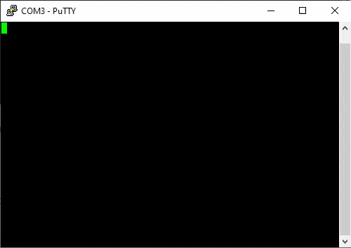

# Casio Loopy C Compiler Template

**NOTE: You can't do much with this yet.** We don't yet know how to make graphics and audio happen.
With that said, this is *technically* a fully functional compiler setup.
If you have a flash cart, you can get this code running on your Loopy.
The code provided is designed for testing with the serial mod described in the SerialDumper section of this repo.  

Additional disclaimer: This is by no means a robust setup. Things will probably break.
Feel free to let me know through issues, PRs etc.
I've already tried to add C++ support and it didn't go well. Please wait for a better toolchain.  

**I am waiting on a proper build toolchain that is currently being set up.**
The code here will be turned into a HAL designed to work alongside that toolchain when available.
There will be no further significant changes to the preliminary toolchain included/described here.  

## Prerequisites

You first need to set up a SuperH GCC toolchain. For Linux:
1. Install the [Wonderful Toolchain wf-pacman](https://wonderful.asie.pl/docs/getting-started/)
2. `wf-pacman -S toolchain-gcc-sh-elf`
3. `export PATH=/opt/wonderful/toolchain/gcc-sh-elf/bin:$PATH`

If you're on Windows I suggest using a Linux VM or WSL2 as Wonderful Toolchain is currently Linux only.  

For the time being, you also need Python 3 installed if you want the checksum fixer script to run.
It will run automatically as part of compilation.
This will probably be replaced with a small self-contained C program soon.  

## Building

Once everything is set up, you can build a Loopy ROM by just running `make` in this directory.
It will produce a `rom.bin` file which is ready for direct use on a flash cart.  

If you have some old setup that requires byte-swapped ROMs (starting with 00 0e),
run `make swapped` and you will get a `rom.nib` which is a suitable byte-swapped file.  

To ensure a clean build after modifications you should use `make clean && make`.  

## Testing with the serial mod

Flash the resulting ROM file to a flash cart and put it in your Loopy.
Connect the serial mod adapter to your PC and open a terminal connection at 9600 baud.
When you power on the Loopy you should see an ASCII-art Loopy "LP" hearts logo and a hello world message.
Assuming you have a working bidirectional serial mod, you can start typing and the Loopy will echo your keypresses back to your terminal.  

Congratulations, you've just compiled and run new code on a Casio Loopy.
Now go have fun poking around with the code... when there's something more interesting to do.  

## What's in the files?

A basic rundown of the files is as follows:  
- Makefile: A somewhat ugly GNU make file to compile for the Loopy. Some build options are configurable here.
- loopy.ld: Linker script used by GCC to place the code into cart ROM, console RAM, etc. It also creates the ROM header.
- fixsum.py: A Python script used by the makefile to calculate and insert the (non-critical) ROM checksum into the header.
- src/startup.s: Raw assembly code to initialize the system, set up the vector table, clear RAM and call main().
- src/main.c: The main program. It sets up a serial connection, prints to it, and then echoes anything it receives.
- src/vectors.c: The interrupt vector table which points interrupts to C functions. Unused vectors are set up to either do nothing or halt.
- src/serial.c, include/serial.h: A basic serial interface layer with blocking writes and buffered reads, similar to Arduino style.
- include/loopy.h: A header file containing Loopy-specific definitions such as F_CPU, also includes sh7021_peripherals.h.
- include/sh7021_peripherals.h: A hopefully complete list of definitions for SH7021 on-chip registers for the various peripherals.
